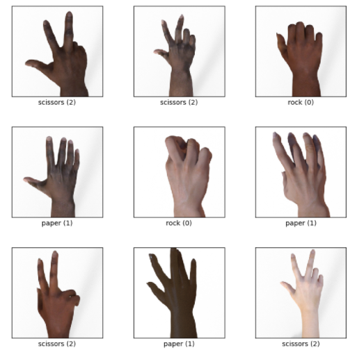

# Rock Paper Scissors AI model
This is a rock paper scissors AI model created for my 3rd year AI module coursework.

For the last coursework in my artificial intelligence module, I was tasked with experimenting with a dataset. I picked a rock paper scissors as you were marked higher if you chose a dataset outside our model. I used the IMDB dataset for my first ever model, but I thought I'd pick something more interesting for my final coursework. 

With this dataset, the aim was to create a model that would accurately guess whether the image of a hand given was rock paper or scissors. These images were computer-generated, and while they exist in TensorFlow, I used the folder version to include a validation set. Below are examples of these images:

The final model had 87% accuracy, and out of the three tests, it correctly predicted whether the image shown was either rock, paper or scissors.

